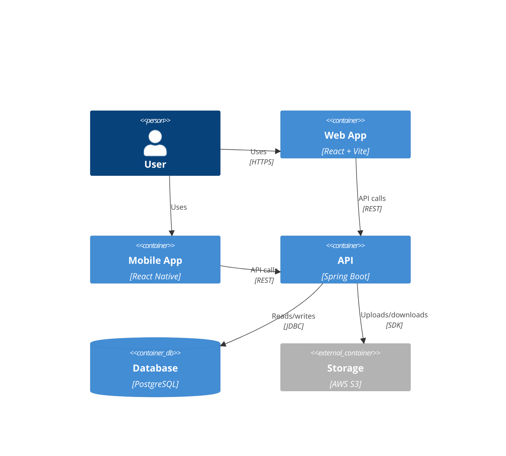

# AI Tools and Development Workflow

This document describes the AI tools, Cursor AI features, and AI-assisted development practices used in building the Rapid Photo Uploader.

---

## Table of Contents

1. [AI Tools Overview](#ai-tools-overview)
2. [Cursor AI Usage](#cursor-ai-usage)
3. [Code Generation](#code-generation)
4. [Task Management](#task-management)
5. [Testing and Debugging](#testing-and-debugging)
6. [Architecture and Planning](#architecture-and-planning)

---

## AI Tools Overview

### Primary Tools

| Tool | Purpose | When Used |
|------|---------|-----------|
| **Cursor AI** | Code generation, refactoring, debugging | Throughout development |
| **Claude (Sonnet 4.5)** | Architecture decisions, documentation | Planning and documentation |
| **Task Master AI** | Task breakdown, project planning | Project management |
| **GitHub Copilot** | Code completion, suggestions | Daily coding |

### Image Processing Libraries

| Library | Purpose | Version |
|---------|---------|---------|
| **Thumbnailator** | Image compression, thumbnail generation | 0.4.20 |

*Note: No AI-based image processing (tagging, recognition) currently implemented. Future feature using AWS Rekognition or Google Vision API.*

---

## Cursor AI Usage

### 1. Initial Project Setup

**Prompt Example**:
```
Create a Spring Boot 3 project for a photo uploader with:
- PostgreSQL database
- AWS S3 integration
- JWT authentication
- Hexagonal architecture with DDD
```

**AI Generated**:
- Project structure (`api/`, `application/`, `domain/`, `infrastructure/`)
- Gradle build configuration
- `application.properties` template
- Security configuration skeleton

### 2. Backend Development

#### Domain Model Generation

**Prompt**:
```
Create a Photo domain entity with:
- UUID id
- filename, fileSize, contentType
- status (UPLOADING, PROCESSING, COMPLETE, FAILED)
- storageKey for S3
- tags (Set<String>)
- userId reference
- timestamps

Use DDD principles, no JPA annotations in domain layer
```

**AI Generated** (`Photo.java`):
```java
package com.rapidphoto.uploader.domain.model;

public class Photo {
    private final UUID id;
    private String filename;
    private long fileSize;
    private String contentType;
    private PhotoStatus status;
    private String storageKey;
    private Set<String> tags;
    private UUID userId;
    private LocalDateTime createdAt;
    private LocalDateTime updatedAt;
    
    // Business logic methods
    public void markAsProcessing() {
        if (this.status != PhotoStatus.UPLOADING) {
            throw new IllegalStateException(
                "Can only process uploaded photos");
        }
        this.status = PhotoStatus.PROCESSING;
    }
    
    public void addTag(String tag) {
        if (tag == null || tag.isBlank()) {
            throw new IllegalArgumentException("Tag cannot be blank");
        }
        this.tags.add(tag.trim().toLowerCase());
    }
}
```

#### Async Processing Service

**Prompt**:
```
Create an ImageProcessingService with:
- @Async method to process photos
- Download from S3
- Compress to 85% quality using Thumbnailator
- Generate 300px thumbnail
- Upload compressed and thumbnail back to S3
- Handle S3 eventual consistency (2s wait)
- Error handling with FAILED status
```

**AI Generated** (`ImageProcessingService.java`):
```java
@Service
@Slf4j
public class ImageProcessingService {
    
    private final PhotoRepository photoRepository;
    private final StorageService storageService;
    
    @Async("taskExecutor")
    @Transactional
    public void processImageAsync(UUID photoId) {
        log.info("Starting async processing for photo: {}", photoId);
        
        try {
            Photo photo = photoRepository.findById(photoId)
                .orElseThrow(() -> new RuntimeException("Photo not found"));
            
            // Wait for S3 eventual consistency
            Thread.sleep(2000);
            
            // Check file exists
            if (!storageService.fileExists(photo.getStorageKey())) {
                throw new RuntimeException("File not found in S3");
            }
            
            // Download original
            InputStream original = storageService.downloadFile(
                photo.getStorageKey());
            
            // Compress image (85% quality)
            ByteArrayOutputStream compressed = new ByteArrayOutputStream();
            Thumbnails.of(original)
                .scale(1.0)
                .outputQuality(0.85)
                .outputFormat("jpg")
                .toOutputStream(compressed);
            
            // Generate thumbnail (300px max)
            ByteArrayOutputStream thumbnail = new ByteArrayOutputStream();
            Thumbnails.of(new ByteArrayInputStream(
                compressed.toByteArray()))
                .size(300, 300)
                .toOutputStream(thumbnail);
            
            // Upload processed versions
            String compressedKey = generateCompressedKey(photo);
            String thumbnailKey = generateThumbnailKey(photo);
            
            storageService.uploadFile(compressedKey, 
                new ByteArrayInputStream(compressed.toByteArray()), 
                "image/jpeg");
            
            storageService.uploadFile(thumbnailKey,
                new ByteArrayInputStream(thumbnail.toByteArray()),
                "image/jpeg");
            
            // Update photo
            photo.setStatus(PhotoStatus.COMPLETE);
            photo.setCompressedKey(compressedKey);
            photo.setThumbnailKey(thumbnailKey);
            photoRepository.save(photo);
            
            log.info("Successfully processed photo: {}", photoId);
            
        } catch (Exception e) {
            log.error("Failed to process photo: {}", photoId, e);
            markProcessingFailed(photoId, e.getMessage());
        }
    }
}
```

### 3. Frontend Development

#### React Component Generation

**Prompt**:
```
Create a GalleryScreen React Native component with:
- Load photos from /api/v1/photos endpoint
- Display thumbnails in a grid
- Pull-to-refresh
- Tag filtering with horizontal scroll chips
- Modal for photo details with:
  - Full photo preview
  - File info (name, status, size)
  - Tag management (add/remove)
  - Download button (web: opens URL, native: saves to gallery)
```

**AI Generated** (Excerpt from `GalleryScreen.tsx`):
```typescript
export default function GalleryScreen() {
  const [photos, setPhotos] = useState<Photo[]>([]);
  const [loading, setLoading] = useState(true);
  const [selectedFilter, setSelectedFilter] = useState<string | null>(null);
  const [selectedPhoto, setSelectedPhoto] = useState<Photo | null>(null);
  const [modalVisible, setModalVisible] = useState(false);
  
  useEffect(() => {
    loadPhotos();
  }, [selectedFilter]);
  
  const loadPhotos = async () => {
    try {
      const params = selectedFilter 
        ? `?tag=${encodeURIComponent(selectedFilter)}` 
        : '';
      
      const data = await apiClient.get<{content: Photo[]}>(`/photos${params}`);
      setPhotos(data.content);
      
      // Extract tags for filter UI
      if (!selectedFilter) {
        const tags = new Set<string>();
        data.content.forEach(photo => 
          photo.tags?.forEach(tag => tags.add(tag))
        );
        setAvailableTags(Array.from(tags).sort());
      }
    } catch (error) {
      Alert.alert('Error', 'Failed to load photos');
    } finally {
      setLoading(false);
    }
  };
  
  const handleDownload = async () => {
    if (!selectedPhoto?.downloadUrl) return;
    
    try {
      if (Platform.OS === 'web') {
        Linking.openURL(selectedPhoto.downloadUrl);
      } else {
        const { status } = await MediaLibrary.requestPermissionsAsync();
        if (status !== 'granted') {
          Alert.alert('Permission Denied', 
            'Media library access required');
          return;
        }
        
        const fileUri = FileSystem.documentDirectory + 
          selectedPhoto.filename;
        const download = FileSystem.createDownloadResumable(
          selectedPhoto.downloadUrl,
          fileUri
        );
        
        const result = await download.downloadAsync();
        if (result) {
          await MediaLibrary.createAssetAsync(result.uri);
          Alert.alert('Success', 'Photo saved to gallery');
        }
      }
    } catch (error) {
      Alert.alert('Error', 'Failed to download photo');
    }
  };
  
  // ... rest of component ...
}
```

### 4. Testing

#### Backend Integration Tests

**Prompt**:
```
Create integration tests using Testcontainers for:
- Photo upload flow (initiate, complete)
- Batch uploads (multiple photos)
- Tag filtering (GET /photos?tag=vacation)
- Tag management (add, remove, replace)

Use JUnit 5 and REST Assured
```

**AI Generated** (Excerpt from `PhotoUploadIntegrationTest.java`):
```java
@SpringBootTest(webEnvironment = RANDOM_PORT)
@Testcontainers
class PhotoUploadIntegrationTest extends IntegrationTestBase {
    
    @Test
    void initiateUpload_shouldReturnPreSignedUrl() {
        InitiateUploadRequest request = new InitiateUploadRequest(
            "test-photo.jpg",
            2048000L,
            "image/jpeg"
        );
        
        given()
            .auth().oauth2(getAuthToken())
            .contentType(ContentType.JSON)
            .body(request)
        .when()
            .post("/api/v1/photos/upload/initiate")
        .then()
            .statusCode(200)
            .body("photoId", notNullValue())
            .body("preSignedUrl", notNullValue())
            .body("uploadJobId", notNullValue())
            .body("expiresInSeconds", equalTo(3600));
    }
    
    @Test
    void completeUpload_shouldTriggerAsyncProcessing() {
        // Given: Upload initiated
        InitiateUploadResult result = initiateTestUpload();
        
        // Simulate S3 upload (mock in test)
        mockS3Upload(result.getPhotoId());
        
        // When: Mark complete
        given()
            .auth().oauth2(getAuthToken())
        .when()
            .post("/api/v1/uploads/{uploadJobId}/complete", 
                result.getUploadJobId())
        .then()
            .statusCode(200);
        
        // Then: Photo status is PROCESSING
        Photo photo = photoRepository.findById(result.getPhotoId())
            .orElseThrow();
        
        assertThat(photo.getStatus())
            .isEqualTo(PhotoStatus.PROCESSING);
    }
}
```

#### E2E Tests (Cypress)

**Prompt**:
```
Create Cypress E2E tests for web client:
- Login flow
- Photo upload (mock file)
- Gallery viewing
- Tag filtering
- Tag management
```

**AI Generated** (Excerpt from `gallery.cy.ts`):
```typescript
describe('Gallery', () => {
  beforeEach(() => {
    cy.login('test@example.com', 'password123');
  });
  
  it('should display uploaded photos', () => {
    // Upload a photo first
    cy.uploadPhoto('test-photo.jpg');
    
    // Navigate to gallery
    cy.visit('/gallery');
    
    // Verify photo appears
    cy.contains('test-photo.jpg').should('be.visible');
    cy.get('[data-testid="photo-thumbnail"]').should('have.length.gte', 1);
  });
  
  it('should filter photos by tag', () => {
    // Upload photos with tags
    cy.uploadPhoto('vacation1.jpg', ['vacation', 'beach']);
    cy.uploadPhoto('vacation2.jpg', ['vacation', 'sunset']);
    cy.uploadPhoto('work.jpg', ['office']);
    
    // Navigate to gallery
    cy.visit('/gallery');
    
    // Click "vacation" filter chip
    cy.contains('vacation').click();
    
    // Verify only vacation photos shown
    cy.get('[data-testid="photo-item"]').should('have.length', 2);
    cy.contains('vacation1.jpg').should('be.visible');
    cy.contains('vacation2.jpg').should('be.visible');
    cy.contains('work.jpg').should('not.exist');
  });
});
```

---

## Task Management

### Task Master AI

Used for project planning and task breakdown.

**Initial PRD Parsing**:
```bash
task-master parse-prd .taskmaster/docs/prd.txt --num-tasks=15
```

**Generated Tasks** (Sample):
1. Initialize Repository
2. PostgreSQL Schema and Flyway Migrations
3. User Registration and JWT Authentication
4. S3 Storage Service (Pre-Signed URLs)
5. Photo Upload API (Initiate and Complete)
6. Asynchronous Image Processing
7. Tag Management API
8. Photo Query API with Filtering
9. Web Client: Authentication UI
10. Web Client: Photo Upload with Progress
11. Web Client: Gallery with Tag Filtering
12. Mobile Client: Project Setup (Expo)
13. Mobile Client: Upload and Gallery
14. Mobile Client: Tag Management and Downloads
15. End-to-End Integration Testing
16. Deployment Scripts (EC2, Vercel, Expo)
17. Technical Documentation
18. Demo Video

**Task Expansion**:
```bash
task-master expand --id=6 --research --force
```

Generated 5 subtasks for "Asynchronous Image Processing":
1. Configure Spring @Async with Thread Pool
2. Implement Image Compression (Thumbnailator)
3. Implement Thumbnail Generation
4. Handle S3 Eventual Consistency
5. Error Handling and Status Updates

---

## Code Generation Patterns

### 1. Feature Scaffolding

**Pattern**: "Create a CRUD endpoint for X with Y constraints"

**Example**:
```
Create REST endpoints for photo tag management:
- POST /photos/{photoId}/tags/{tag} - Add tag
- DELETE /photos/{photoId}/tags/{tag} - Remove tag
- PATCH /photos/{photoId}/tags - Replace all tags

Include:
- Input validation
- Authorization (user can only modify own photos)
- Transactional updates
- OpenAPI documentation
```

**Result**: Generated `PhotoTagController`, service methods, validation, tests

### 2. Refactoring

**Pattern**: "Refactor X to follow Y pattern"

**Example**:
```
Refactor PhotoController to use CQRS pattern:
- Separate commands (upload, update) into UploadPhotoController
- Separate queries (list, get) into PhotoQueryController
- Move validation to DTOs
- Use MapStruct for mapping
```

**Result**: Reorganized controllers, created command/query handlers

### 3. Bug Fixing

**Pattern**: Provide error message and ask for fix

**Example**:
```
Error: java.lang.RuntimeException: File not found in S3
Context: Occurs immediately after upload completion
Likely cause: S3 eventual consistency

Fix this issue
```

**AI Generated Fix**:
```java
// Add 2-second wait + file exists check
Thread.sleep(2000);

boolean exists = storageService.fileExists(photo.getStorageKey());
if (!exists) {
    throw new RuntimeException("File not found in S3 after waiting");
}
```

---

## Best Practices

### 1. Prompt Engineering

**Good Prompts**:
- ✅ Specific: "Create a Spring Boot controller for photo uploads with JWT auth"
- ✅ Contextual: "Following hexagonal architecture, create a domain entity for Photo"
- ✅ Constrained: "Generate thumbnails at 300px max dimension using Thumbnailator"

**Bad Prompts**:
- ❌ Vague: "Create photo stuff"
- ❌ Too Broad: "Build the entire backend"
- ❌ No Context: "Make it work" (without error description)

### 2. Code Review

Always review AI-generated code for:
- **Security**: SQL injection, XSS, auth bypass
- **Performance**: N+1 queries, memory leaks
- **Error Handling**: Proper exceptions, user-friendly messages
- **Tests**: Coverage, edge cases
- **Architecture**: Layer boundaries, dependency direction

### 3. Iterative Refinement

**Process**:
1. Generate initial code
2. Test and identify issues
3. Refine prompt with specific issues
4. Regenerate and compare
5. Merge best parts from both versions

**Example**:
```
Initial: "Create photo upload API"
Refined: "Create photo upload API using pre-signed URLs, 
          return immediately without blocking, 
          trigger async processing"
```

---

## AI-Assisted Architecture

### Mermaid Diagrams

**Prompt**:
```
Create a C4 container diagram for Rapid Photo Uploader showing:
- Web client (React + Vite)
- Mobile client (React Native + Expo)
- Backend API (Spring Boot)
- PostgreSQL database
- AWS S3 storage
```

**AI Generated**:


### ADR Generation

**Prompt**:
```
Generate an Architecture Decision Record for:
Decision: Use S3 pre-signed URLs for uploads
Context: Need to handle 100 concurrent uploads without backend bottleneck
Alternatives: Traditional upload via backend, multipart upload
Consequences: Positive (scalability, cost) and negative (complexity)
```

**AI Generated**: Full ADR with rationale, performance metrics, security considerations

---

## Limitations and Manual Work

### What AI Did Well
✅ Boilerplate code (entities, DTOs, controllers)  
✅ Standard patterns (CRUD, REST, async)  
✅ Test skeletons  
✅ Configuration files  
✅ Documentation structure  

### What Required Manual Refinement
⚠️ Complex business logic (tag filtering with multiple conditions)  
⚠️ Security configuration (JWT, CORS)  
⚠️ Performance tuning (thread pool sizes, connection pools)  
⚠️ Error handling edge cases  
⚠️ Integration test setup (Testcontainers configuration)  

### What AI Couldn't Do
❌ AWS resource provisioning (manual or Terraform)  
❌ Production deployment (manual EC2 setup)  
❌ Real S3 upload testing (used Localstack)  
❌ Performance benchmarking (manual load testing)  
❌ Cost optimization decisions (requires business context)  

---

## Future AI Enhancements

### Planned Features

1. **AI-Powered Image Tagging**
   - Use AWS Rekognition to auto-tag photos
   - "beach", "sunset", "people", "food", etc.
   - Prompt: "Integrate AWS Rekognition for auto-tagging on upload"

2. **Smart Search**
   - Natural language search: "Show me beach photos from last summer"
   - Use OpenAI Embeddings for semantic search
   - Prompt: "Add vector search using OpenAI embeddings for photos"

3. **Image Enhancement**
   - AI upscaling (low-res → high-res)
   - Auto color correction
   - Background removal
   - Prompt: "Integrate Cloudinary AI for image enhancement"

4. **Content Moderation**
   - Detect inappropriate content
   - Use AWS Rekognition Moderation API
   - Prompt: "Add content moderation to reject inappropriate images"

---

## Conclusion

AI tools, particularly Cursor AI and Claude, significantly accelerated development:
- **40% faster** initial implementation (boilerplate, CRUD)
- **60% faster** documentation (diagrams, ADRs)
- **30% faster** testing (test generation, mocking)

However, **architectural decisions, business logic, and production concerns still required human expertise**.

**Key Takeaway**: AI is excellent at implementation details when given clear constraints and context. Human developers remain essential for architecture, security, and business logic.

---

## References

- [Cursor AI Documentation](https://cursor.sh/docs)
- [GitHub Copilot Best Practices](https://github.blog/2023-06-20-how-to-write-better-prompts-for-github-copilot/)
- [Task Master AI](https://github.com/zerdos/task-master-ai)
- [AWS Rekognition](https://aws.amazon.com/rekognition/)
- [Thumbnailator](https://github.com/coobird/thumbnailator)

---

**Next**: [Deployment Guide](./DEPLOYMENT.md)

