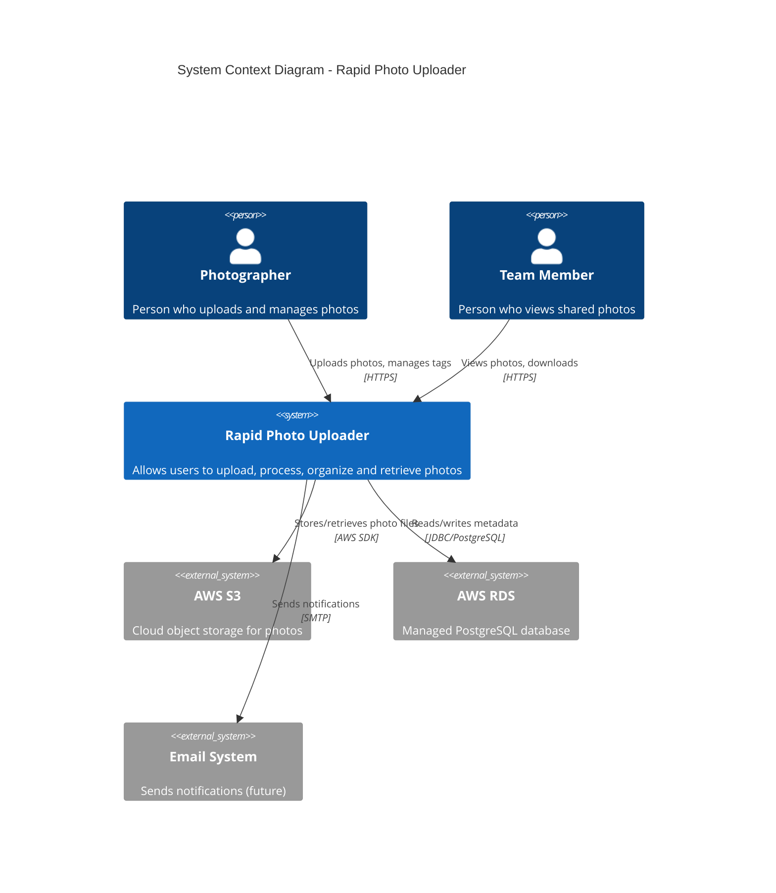
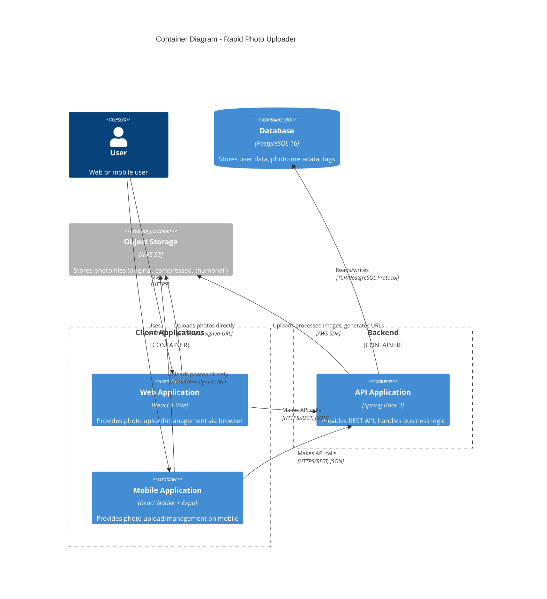
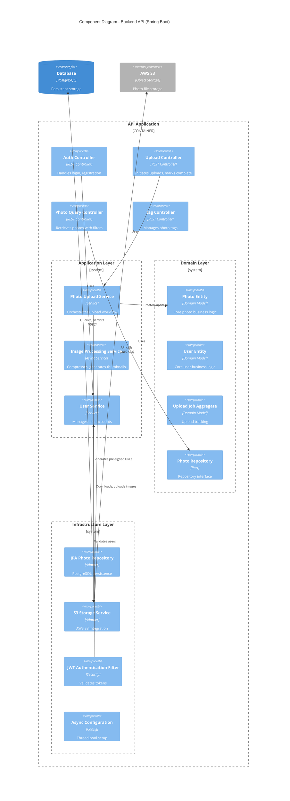
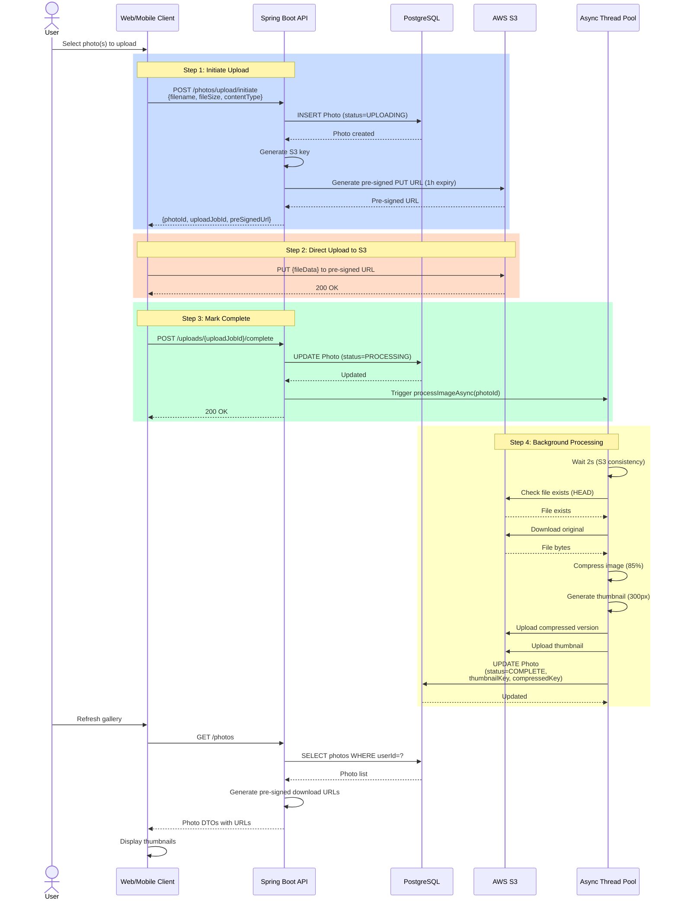
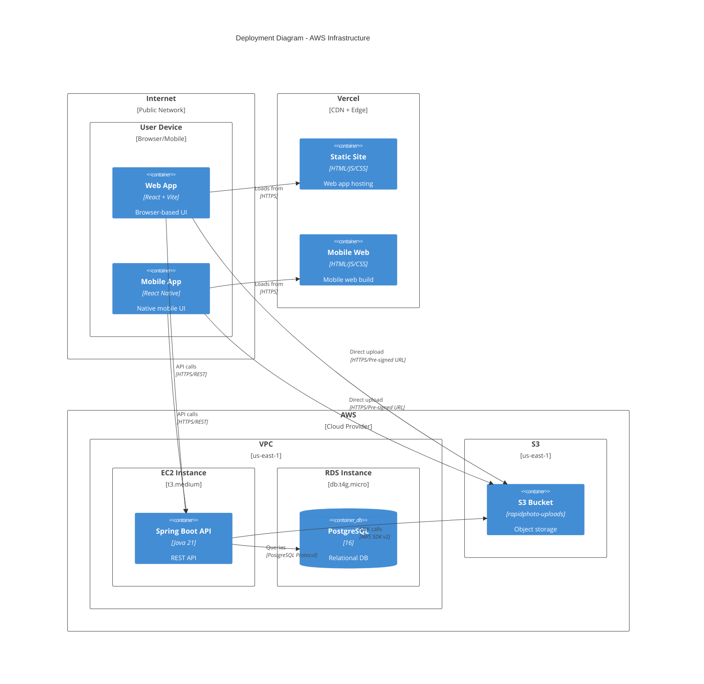

# C4 Architecture Diagrams

This document contains C4 model diagrams for the Rapid Photo Uploader system, from high-level context down to detailed component views.

## Table of Contents
1. [Level 1: System Context](#level-1-system-context-diagram)
2. [Level 2: Container](#level-2-container-diagram)
3. [Level 3: Component (Backend)](#level-3-component-diagram---backend)
4. [Supplementary: Upload Sequence](#supplementary-upload-sequence-diagram)

---

## Level 1: System Context Diagram

Shows the system in its environment and its relationships with users and external systems.



### Key Relationships

| From | To | Description | Protocol |
|------|-----|-------------|----------|
| Photographer | Rapid Photo System | Uploads photos, manages tags, organizes | HTTPS/REST |
| Team Member | Rapid Photo System | Views photos, downloads, filters | HTTPS/REST |
| Rapid Photo System | AWS S3 | Stores original/processed photos | AWS SDK v2 |
| Rapid Photo System | AWS RDS | Stores photo metadata, users, tags | PostgreSQL JDBC |

---

## Level 2: Container Diagram

Shows the high-level technology choices and how containers communicate.



### Container Details

#### Web Application (React + Vite)
- **Technology**: React 18.3, TypeScript, Vite 6.0
- **Purpose**: Browser-based photo management
- **Key Features**:
  - Batch photo upload (up to 100)
  - Real-time upload progress
  - Photo gallery with filtering
  - Tag management
- **Deployment**: Vercel (CDN + Edge Functions)
- **State Management**: React Query (TanStack Query)

#### Mobile Application (React Native + Expo)
- **Technology**: React Native 0.81.5, Expo SDK 54, TypeScript
- **Purpose**: Native mobile photo management (iOS/Android/Web)
- **Key Features**:
  - Camera integration (expo-camera)
  - Photo picker (expo-image-picker)
  - Secure token storage (expo-secure-store)
  - Download to device (expo-media-library)
- **Deployment**: Expo Go (dev), Web build (Vercel), EAS Build (future native)

#### API Application (Spring Boot 3)
- **Technology**: Spring Boot 3.5.7, Java 21
- **Purpose**: Business logic, orchestration, security
- **Key Features**:
  - JWT authentication
  - Pre-signed URL generation
  - Asynchronous image processing
  - Tag management
  - CQRS pattern implementation
- **Deployment**: AWS EC2 (Amazon Linux 2023)
- **Port**: 8080

#### Database (PostgreSQL 16)
- **Technology**: PostgreSQL 16 on AWS RDS
- **Purpose**: Store structured data (users, photos, tags)
- **Schema**:
  - `users` - User accounts
  - `photos` - Photo metadata
  - `photo_tags` - Many-to-many relationship
- **Deployment**: AWS RDS (db.t4g.micro)
- **Backups**: Automated daily snapshots

#### Object Storage (AWS S3)
- **Technology**: AWS S3
- **Purpose**: Store binary photo files
- **Bucket Structure**: `{userId}/{year}/{month}/{day}/{photoId}-{filename}`
- **File Types**:
  - Original uploads
  - Compressed versions (85% quality)
  - Thumbnails (300px max dimension)
- **Access**: Pre-signed URLs only (no public access)
- **Lifecycle**: Transition to Standard-IA after 90 days

---

## Level 3: Component Diagram - Backend

Shows the internal structure of the API application, organized by DDD layers.



### Component Responsibilities

#### API Layer (Controllers)

**AuthController**
```java
@RestController
@RequestMapping("/api/v1/auth")
public class AuthController {
    POST /register - Create new user account
    POST /login    - Authenticate and return JWT
}
```

**UploadPhotoController**
```java
@RestController
@RequestMapping("/api/v1/photos")
public class UploadPhotoController {
    POST /upload/initiate              - Start upload, get pre-signed URL
    POST /uploads/{uploadJobId}/complete - Mark upload complete
}
```

**PhotoQueryController**
```java
@RestController
@RequestMapping("/api/v1/photos")
public class PhotoQueryController {
    GET  /photos                - List photos (paginated, filtered)
    GET  /photos/{id}           - Get single photo details
}
```

**PhotoTagController**
```java
@RestController
@RequestMapping("/api/v1/photos/{photoId}/tags")
public class PhotoTagController {
    POST   /{tag}  - Add tag to photo
    DELETE /{tag}  - Remove tag from photo
    PATCH  /       - Replace all tags
}
```

#### Application Layer (Services)

**PhotoUploadService**
- Coordinates upload workflow
- Generates S3 pre-signed URLs
- Creates Photo entities
- Triggers async processing

**ImageProcessingService**
- Runs in background thread pool
- Downloads original from S3
- Compresses image (85% quality)
- Generates thumbnail (300px)
- Uploads processed versions back to S3
- Updates Photo status to COMPLETE

**UserService**
- User registration with BCrypt
- Authentication and JWT generation
- User profile management

#### Domain Layer

**Photo Entity**
```java
@Entity
public class Photo {
    - UUID id
    - String filename
    - Long fileSize
    - String contentType
    - PhotoStatus status (UPLOADING, PROCESSING, COMPLETE, FAILED)
    - String storageKey (S3 key)
    - Set<String> tags
    - UUID userId
    - Timestamps
}
```

**User Entity**
```java
@Entity
public class User {
    - UUID id
    - String email (unique)
    - String fullName
    - String passwordHash (BCrypt)
    - Timestamps
}
```

**UploadJob Aggregate**
```java
@Entity
public class UploadJob {
    - UUID id
    - UUID photoId
    - JobStatus status
    - String errorMessage
    - Timestamps
}
```

#### Infrastructure Layer

**JPA Photo Repository**
- Implements PhotoRepository interface
- Provides custom queries:
  - `findByUserId(UUID userId)`
  - `findByStatus(PhotoStatus status)`
  - `findByTagsContaining(String tag)`
  - `findByUserIdAndStatus(...)`

**S3 Storage Service**
- Implements StorageService interface
- Generates pre-signed URLs (upload/download)
- Uploads files to S3
- Downloads files from S3
- Checks file existence

**JWT Authentication Filter**
- Intercepts all requests
- Extracts JWT from Authorization header
- Validates token signature and expiry
- Sets Spring Security context

**Async Configuration**
- Configures thread pool:
  - Core: 5 threads
  - Max: 20 threads
  - Queue: 100 tasks
- Named executor: `taskExecutor`

---

## Supplementary: Upload Sequence Diagram

Detailed sequence showing the complete upload workflow.



### Key Observations

1. **Non-Blocking**: Steps 1-3 complete in < 1 second. User gets immediate feedback.
2. **Direct Upload**: Client uploads directly to S3, bypassing backend for large files.
3. **Background Processing**: Image compression happens asynchronously, doesn't block upload.
4. **Eventual Consistency**: 2-second wait accounts for S3's eventual consistency model.
5. **Pre-Signed URLs**: All S3 access uses temporary, expiring URLs for security.

---

## Deployment View

Shows how components are deployed across infrastructure.



### Infrastructure Details

| Component | Type | Size | Purpose | Cost/Month |
|-----------|------|------|---------|-----------|
| EC2 Instance | t3.medium | 2 vCPU, 4 GB RAM | Backend API | ~$30 |
| RDS PostgreSQL | db.t4g.micro | 2 vCPU, 1 GB RAM, 20 GB SSD | Database | ~$15 |
| S3 Bucket | Standard | Variable storage | Object storage | $0.023/GB |
| Vercel | Hobby/Pro | N/A | Web hosting | Free/$20 |
| **Total** | | | | **~$45-65/mo** |

---

## Next Steps

- [Architecture Overview](./ARCHITECTURE.md)
- [Architecture Decision Records](./ADR/)
- [API Reference](./API_REFERENCE.md)
- [Deployment Guide](./DEPLOYMENT.md)

